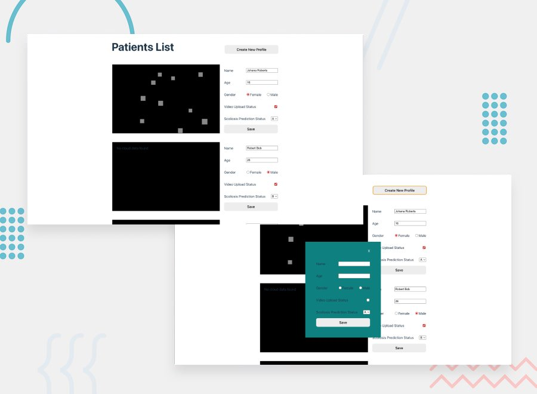

# Momentum Health - Scoliosis code challenge solution



## Table of contents

- [Overview](#overview)
  - [The challenge](#the-challenge)
  - [Build](#build)
- [My process](#my-process)
  - [Built with](#built-with)
  - [What I learned](#what-i-learned)
- [Author](#author)

## Overview

### The challenge

Building a Basic Patient Information Dashboard with a 3D Visualizer

- Create a single-page application (SPA) using React JS and TypeScript that presents patient data, fetched from an API, in a visually clear and user-friendly manner. Additionally, the application should include a 3D visualizer using Three.js to display patient point cloud data.

- Create a mock API or use JSON Server to host your mock data: Create a JSON file to simulate the responses an API would send for a user's basic info.
  - name
  - age
  - gender
  - video upload status
  - scoliosis prediction status
  - point cloud data

- Fetch and display data: Write a React component that fetches this data and displays the basic patient information in an organized manner on the page. Make sure to handle loading and error states appropriately.

- 3D Point Cloud Visualization: Using the fetched pointCloudData and Three.js (library), create a 3D point cloud visualization that displays when a user selects a patient. You can use React-Three-Fiber, a React renderer for Three.js, to integrate this into your React application. Please add some random 3D data that you can find on the web.

- Styling and responsiveness: Make the application responsive so that it maintains its layout on different screen sizes.

Users should be able to:

- Add a new patient by submiting a form.
- Manually alter the the specific patient data. The feature should be designed in a way that users can clearly see whether the data is being fetched or if an error has occurred.
  - videoUploadStatus
  - scoliosisPredictionStatus
  - pointCloudData

### Build

- Copy the directory from Github

```bash
git clone https://github.com/GerardoCianciulli/scoliosis.git
```

- Run the SPA with Vite

```bash
cd scoliosis
npx vite
```

- In a seperate terminal run the server

```bash
cd scoliosis
npx json-server db.json
```

## My process

### Built with

- React
- TypeScript
- Vite
- ThreeJs
- Semantic HTML5 markup
- CSS custom properties
- Flexbox
- Media Queries

### What I learned

I improved my understanding of react hooks, specifically useRef and useEffect as well as how to avoid memory leaks by catching errors when calling an API. Three.js requestAnimationFrame needs to be cleaned up when used inside useEffect. To do this you must return a function that calls cancelAnimationFrame using the latest frame ID. Failing to do this causes animation frames to stack up perpetually, triggering catastrophic memory leaks and UI performance degradation. Because an animation loop schedules a new frame ID on every single tick, you must store the active ID in a mutable useRef. This ensures your cleanup function always targets the exact, live animation frame currently queued by the browser.

## Author

- Portfolio - [Gerardo Cianciulli](https://www.behance.net/gerardo-cianciulli)
- Frontend Mentor - [Gerardo Cianciulli](https://www.frontendmentor.io/profile/GerardoCianciulli)
- Linkedin - [Gerardo Cianciulli](https://www.linkedin.com/in/gerardo-cianciulli/)
